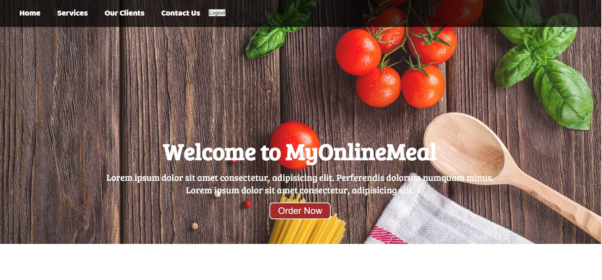
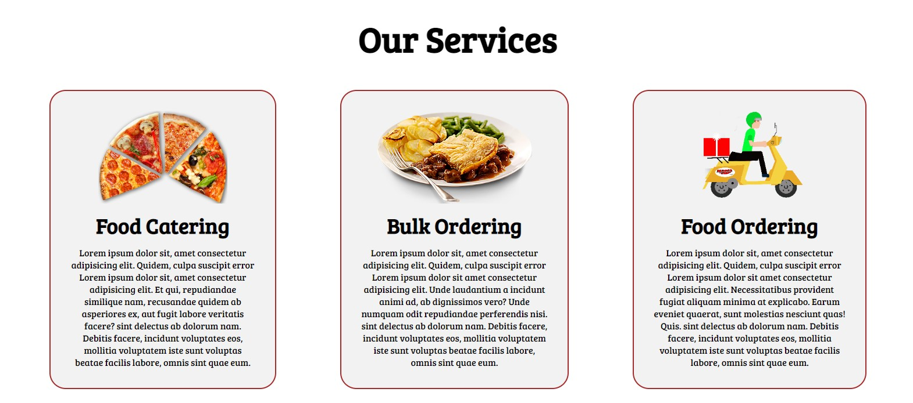
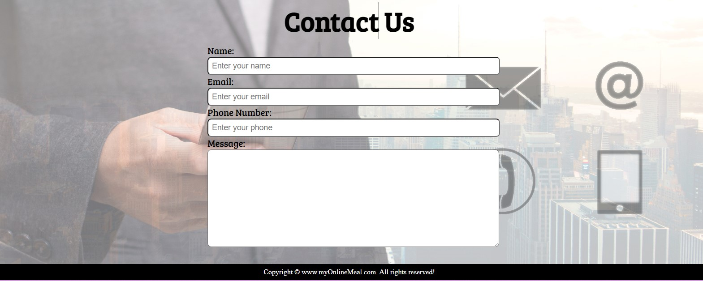
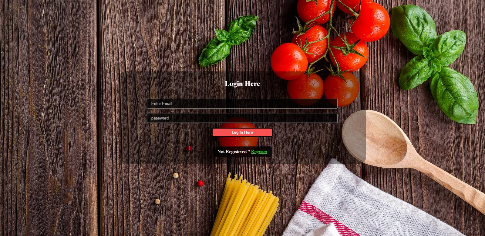

##  Pro Technical Service💻

 
 

    Description of Project

 

#### Front-end

- HTML 
- CSS 3
- JAVA SCRIPT
- Styling: PLANE CSS
 
 
#### Back-end

- For handling index requests: `Node.js with Express.js Framework`
- As Database: `MONGO DB`
- API tested using: `POSTMAN`
- Dependenc : `Bcrypt body-parser cors ditenv express nongoose`
 
 
 

## About My Project

| Project Name | Source-Code:-> Backend / Frontend |   Demo   | Descriptions |
| --- | --- | --- | --- | 
| Food App  | [Click](https://github.com/Aakashsharma24/food-app-backend) / [Click](https://github.com/Aakashsharma24/foodapp-frontend)| [Demo](https://aakashsharma24.github.io/foodapp-frontend/) |We deliver food online through customers choosen Restaurants and Hotels in time.We always provide quality and hygenic 
 
 
               Try ones will never forget